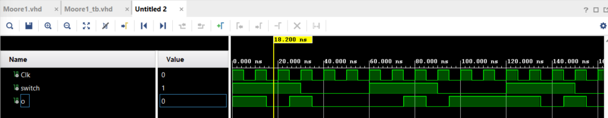
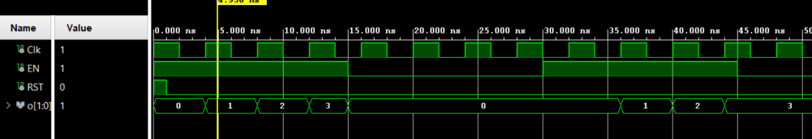
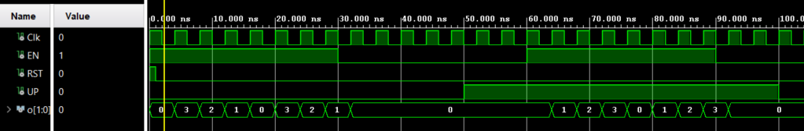

For the very simple moore machine
- Using normal encoding: 1 bit should be enough
- Using one-hot : 2 bits would be needed 01 and 10.

Moore 1.

Moore 2.

The output increases each time the clock rise if the enable is on.

The RST returns to 0 when on 1.

Moore 3.

The output increases when Up is to 1, and decreases when it is to 0. RST resets all. When EN is false, nothing happens.